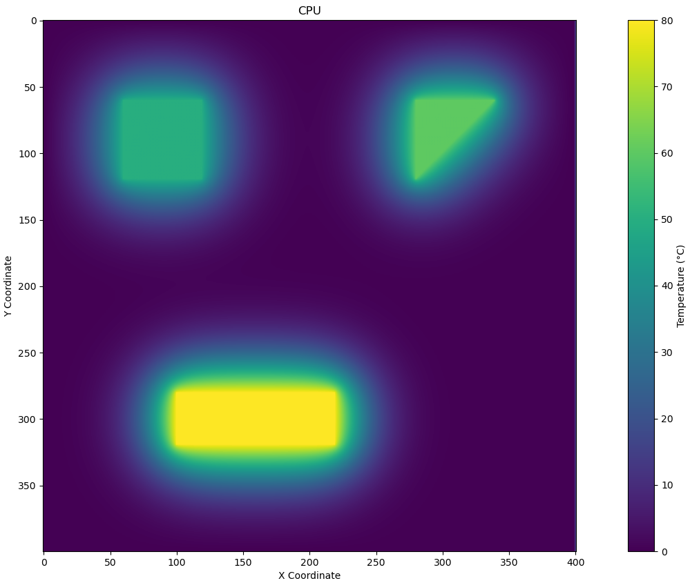
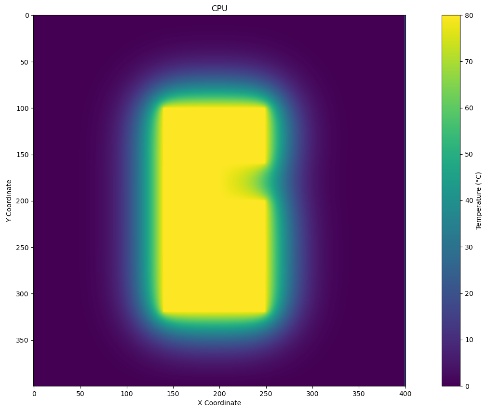

# Hővezetési Szimulációs Program

Ez a projekt egy hővezetési szimulációs program, amely összehasonlítja a CPU (egyszálas C) és a GPU (CUDA) teljesítményét a hőmérséklet eloszlásának kiszámításában. A program beolvas egy poligonfájlt, amely a felületen lévő hősugárzó objektumokat ábrázolja, és kiszámítja a hővezetést egy meghatározott rácspontokon x iteráció után.

## Tartalomjegyzék

- [Bevezetés](#bevezetés)
- [Használat](#használat)
- [Eredmények](#eredmények)
- [Eredmények Plottolása](#eredmények-plottolása)
- [Képek](#képek)

## Bevezetés

A projekt célja, hogy megvizsgálja, hogyan teljesít a GPU-alapú hőmérséklet-szimuláció a CPU-hoz képest. Az alkalmazás beolvas egy poligon-fájlt, amely tartalmazza a hősugárzó objektumok pozícióját és hősugárzási teljesítményét, és a hőmérséklet eloszlását számolja ki a megadott iterációk során.

### Követelmények

- CUDA 10.1 vagy újabb
- GCC
- Python 3.x
- Matplotlib

### Lépések

1. Klónozd a repót:
   ```bash
   git clone https://github.com/matyi697/thermo-simulation
   cd thermo-simulation
   ```

2. A C program fordítása (CPU):
   ```bash
   gcc -o Simple/main.c cpu_simulation.c -lm
   ```

3. A CUDA program fordítása (GPU):
   ```bash
   nvcc -o GPU/main.cu gpu_simulation.cu
   ```

4. A Python könyvtárak telepítése:
   ```bash
   pip install matplotlib numpy
   ```

## Használat

A program futtatásához a következő parancsokat használhatod:

### CPU verzió
```bash
./cpu_simulation polygonFile.txt results.csv
```

### GPU verzió
```bash
./gpu_simulation polygonFile.txt results.csv
```

Itt az `polygonFile.txt` a hősugárzó objektumokat tartalmazó fájl, míg a `results.csv` a hőszimuláció végén kapott hőmérséklet adatok pontfelhője.

## Eredmények

A program a hőmérséklet eloszlást számolja ki a megadott rácspontokon, és a futási időt is kiértékeli mindkét megvalósítás esetében. A mért időket összehasonlítjuk a CPU és GPU verziók között.

### Tesztek eredményei
```plaintext
#Teszt 1 - (400x400, polygons1.txt)
CPU futási idő: 49,751 másodperc
GPU futási idő: 2,074 másodperc

#Teszt 2 - (400x400, polygons2.txt)
CPU futási idő:  másodperc
GPU futási idő:  másodperc

#Teszt 3 - (400x400, polygons3.txt)
CPU futási idő:  33,886 másodperc
GPU futási idő:  2,126 másodperc
```

## Eredmények Plottolása

A futási eredmények vizualizálásához futtasd a következő Python szkriptet:

```bash
python plotter.py results.csv --title "CPU/GPU" --interpolation "bilinear"
```

Ez a szkript megjeleníti a results.csv pontfelhőben lévő hőmérséklet adatokat egy hőmérsékleti térképen.

## Képek



